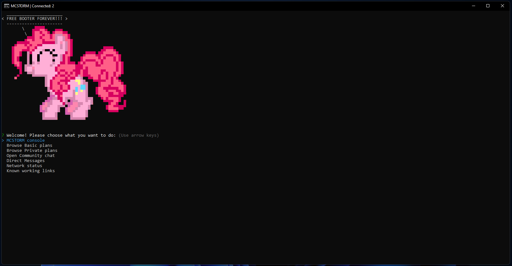
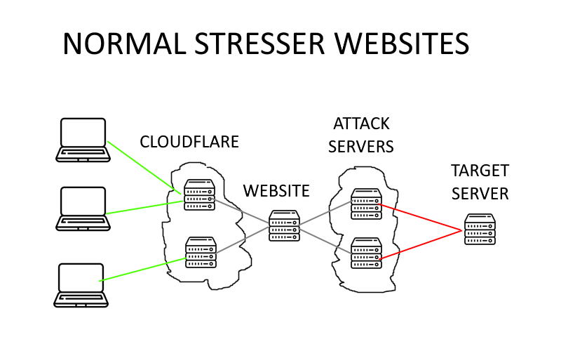
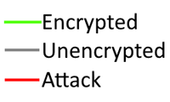
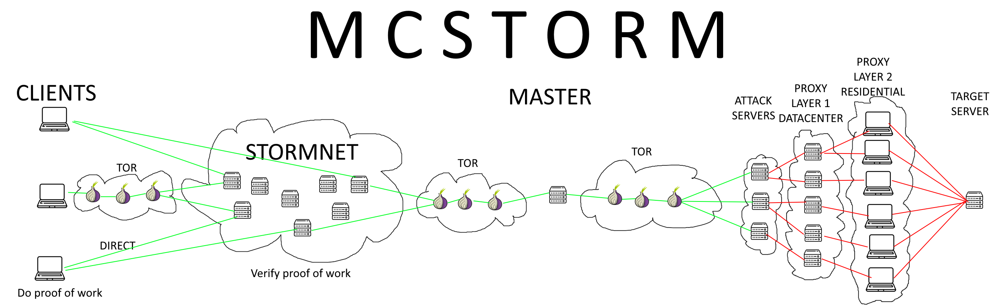

# STORMNET-MCSTORM-Client
STORMNET allows secure encrypted communication on a decentralized network. MCSTORM built in.

Usage Windows:
1. Download
2. Extract
3. Double click `run.bat`
4. (First use) if a warning appears about running an unknown program, click `Show more` and click `Run anyways`

Usage Linux: 
1. Install nodejs and npm `sudo apt install nodejs npm` and optionally tor `sudo apt install tor`
2. Clone repository: `git clone https://github.com/NotNullV1/STORMNET-MCSTORM-Client.git mcstorm`
3. Go to the folder: `cd mcstorm`
4. Install npm packages: `npm i`
5. Run: `npm start`

## Introduction

After the FBI's big seizure of stressors in December 2022, most providers just moved their services to a new domain name and continue their operations as usual, using the same unsecured and extremely dangerous techniques both to the providers as well as their clients. Since then, there have been new reports of stressor websites being seized and their users arrested.

## Current techniques

Cloudflare is a popular service offering various benefits such as improved website performance, security features, and protection against Distributed Denial of Service (DDoS) attacks. One of its main features stressor services use it for is the ability to hide the webserver's IP address and keep the hosting provider unknown, therefore protecting it from being reported to the hosting provider by overzealous individuals.

Additionally, Cloudflare provides SSL certificates to enable secure connections between clients and websites. However, Cloudflare's default Flexible SSL mode presents certain privacy and security issues due to its lack of end-to-end encryption.

Unencrypted communications are particularly vulnerable to Man-in-the-Middle (MITM) attacks, which can compromise the privacy and security of the data being transmitted. A Man-in-the-Middle attack is a type of cyber attack in which an unauthorized third party or hackers such as the FBI, intercepts and potentially alters the communication between two parties, usually without their knowledge. The attacker positions themselves between the victim (client) and the intended recipient (server), effectively becoming a "middleman" in the communication process.

In Cloudflare's Flexible SSL mode, data is only encrypted between the client and Cloudflare's servers. The communication between Cloudflare and the origin server remains unencrypted, leaving the transmitted data exposed to logging and manipulation. This lack of end-to-end encryption can create security vulnerabilities and undermine the privacy of users. Not only can the stressor itself view the unencrypted data transmitted between the client and the origin server, but other intermediaries, such as the stressors webserver's hosting or the FBI, can also potentially see and log all activity directly linked to IP addresses leading to breaches in privacy and potential arrests of the stressor's users.

Unencrypted communication between the stressor's web server and its attack servers can also be easily intercepted by unauthorized parties,  hackers such as the FBI, or other malicious actors. This can lead to unauthorized access to sensitive information, including user data, personal data, and confidential business data.

Apart from unencrypted communication, there are other security issues that can arise when interacting with websites in general. These concerns include the logging of IP addresses, browser information, and user activity by Cloudflare servers and the websites themselves. Stressor websites almost always claim they remove logs every day, but this is most of the time not true. If the website stores this data in an insecure manner or does not employ proper security measures, which it usually does not, it can become vulnerable to attacks such as SQL injection or seizure-of-servers attacks by the FBI.

## MCSTORM's new approach

We introduce a new groundbreaking technology designed to comprehensively address these challenges, providing a robust and holistic solution for securing online communications and preserving user privacy. Our novel approach combines advanced cryptography, decentralization, and anonymity techniques, which work together to create a secure and private environment for users, completely removing the risk of seizure of domain names (because it does not use any domain names) and significantly reducing the risk of seizure of servers, identity discovery, unauthorized access to sensitive information, and arrest of service's users.

## STORMNET: A Decentralized, Privacy-Preserving Communication Network

Instead of clients connecting to a website or a command server directly, they connect using a decentralized network of nodes run by volunteers.

### Network architecture

STORMNET's architecture consists of two main types of nodes: open nodes and clients (also known as closed nodes). Open nodes act as intermediaries, relaying messages between clients. Clients, on the other hand, are the end-users who send and receive messages through the network.

Each client knows the entire list of open nodes but connects to only a subset of them. If a client receives a message it has never seen before, the message is redirected to all connected open nodes. In the same way, if an open node receives a message, it is redirected to all connected clients. The messages are indistinguishable, meaning that they all appear the same to any observer, regardless of whether the message is an original message from a client or a forwarded message from another client. This design choice adds a layer of anonymity for clients as it becomes virtually impossible to differentiate between the sender and a forwarder of a message. Additionally, the use of random delays in message sending further enhances the anonymity and makes it more difficult for potential attackers such as the FBI to perform traffic analysis or correlate messages.

A potential deanonymization attack could be executed by creating a large number of open nodes and waiting for a single client to connect to only the controlled nodes. If a single IP address is connected to only nodes controlled by an attacker such as FBI, it is logical that all messages are coming only from the connected node and no other one, because it has no information about other messages. This way the public key of the client can be linked with an IP address. To prevent such type of attack, each client connects to a random number of open nodes, so the attacker does not know if the client is connected to other nodes or not. Furthermore, clients can choose to use Tor, therefore hiding the IP address completely. A combination of the Tor client deanonymization attack with the STORMNET client deanonymization attack is practically impossible to perform successfully.

### Encryption

STORMNET ensures secure and anonymous communication by employing a hybrid encryption approach, which combines the benefits of both symmetric and asymmetric encryption. Messages are encrypted using the Advanced Encryption Standard (AES), a symmetric encryption algorithm that provides fast and efficient encryption for large amounts of data. To securely exchange the AES keys between the clients, the RSA algorithm, an asymmetric encryption method, is used. This allows for secure key exchange without exposing the message content.

### Peer discovery

Clients share the IP addresses of open nodes with each other randomly. When a client receives a new IP address, they can test the connection by sending a getStormnetVersion request. If the server responds with the correct STORMNET version, it is considered a valid open node.

### Proof of Work

STORMNET implements a Proof of Work (PoW) mechanism to prevent spam and denial-of-service attacks. Each client must perform a PoW task and include the result in their messages. This ensures that clients spend a certain amount of computational resources before sending messages, limiting the rate at which they can send messages and reducing the risk of network congestion. This is particularly important for the peer discovery process as if an attacker would flood the network with a single IP address, all clients would try to test the connection to this IP, which could result in a denial of service attack as the tested IP would be flooded with the test connections.

### Conclusion

STORMNET offers a robust, anonymous, and secure communication network that stands up to the challenges of censorship, surveillance, and disruption by the FBI. By employing a unique architecture and advanced cryptography, the system ensures the privacy and security of its users. This design choice makes it resistant to both centralized control and targeted attacks. As pressure from law enforcement agencies continues to evolve and new threats emerge, STORMNET serves as an innovative solution that prioritizes the protection of its users' privacy and the integrity of their communications.

## Dear stressor website owners and C2 operators!

We invite you all to join STORMNET and encourage your users to connect through our secure and anonymous network. By joining STORMNET and promoting its use among your users, you'll be part of a growing community committed to protecting online privacy and freedom. Additionally, we are calling on dedicated individuals to contribute by running open nodes, which play a crucial role in maintaining and strengthening the STORMNET infrastructure. Running an open node is a simple and affordable process, requiring only a small server with an open TCP port. By hosting an open node, you'll contribute to a decentralized network that protects the privacy and security of its users. Open node operators are the backbone of STORMNET, ensuring the resilience, stability, and scalability of the network. Let's work together to build a safer and more private world where stressor owners and their users do not need to worry about being arrested or their electronics seized!

**Open node software:** https://github.com/NotNullV1/STORMNET-open-node
